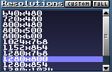
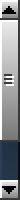

There are plenty of different UI elements in MT.
Here, we'll be covering the interactive ones and how they behave.

<!-- TODO: Tickbox? -->

## Buttons

 A button from the [general editor buttons window](#general-editor-buttons-window). 
 Pressed.

The simplest of them all!
Left-mouse clicking activates the action associated with the button.
Right-mouse clicking shows the button as clicked, but doesn't actually "click" it.

## Checkboxes

Toggles a certain behaviour on or off.
When on, there is a check inside the box.

These are commonly found in the [instrument editor](./ui.md#instrument-editor) and settings.

## Listviews

 
A listview of resolutions MT supports.

Allows selection of an element from a list, either by double left-mouse clicking or right-mouse clicking on the element in the list.

Listviews have a scrollbar, which behaves similarly to [sliders](#sliders), except for the fact they are vertical, and their fine tune buttons have the arrow characters, instead of the `+` and `-`.

The most important listviews in MT are in the [disk operations window](./ui.md#disk-operations-window) and the [instrument](./ui.md#instrument-menu) and [sample menus](./ui.md#sample-menu).

## Radio buttons

 
Radio buttons for the scale multiplier of the MT resolutions.

Select one of the given options.
The selected option will have a point in the circle next to the radio button, while the rest have empty circles next to them.

You can find radio buttons in the [instrument](./ui.md#instrument-editor) and [sample editors](./ui.md#sample-editor).

## Scrollbars

 Horizonal. 
 Vertical.

Allows scrolling.

The arrow characters at the edges of the scrollbar are used for fine-tuned scrolling.

Horizonal scrollbars are seen in the [playlist](./ui.md#playlist) and [sample editor](./ui.md#sample-editor).
The vertical ones are seen in the [instrument](./ui.md#instrument-menu) and [sample menus](./ui.md#sample-menu).

## Sliders

Allows setting a value from a fixed interval, by sliding the box within the slider.

The `+` and `-` buttons that are on the edge of the slider allow for a fine tune of the value which is being set, by increasing and decreasing it, respectfully.

They are commonly seen in the [instrument editor](./ui.md#instrument-editor) (volume, panning, fine tune, fadeout, etc).

## Text input fields

There are only a few of these fields in MT.
They are:

- [The song title text input field](./ui.md#song-title-length-and-peak-window--common-mt-options-toggle-window)
- [Instrument name text input fields](./ui.md#instrument-menu)
- [Sample name text input fields](./ui.md#sample-menu)

These elements work in the following way:

- Double left-mouse clicking or right-mouse clicking on the field toggles a cursor and allows the user to edit the text in the field
- Hitting `Enter` saves the text into the field
- Hitting `Esc` resets the text to what it was before the editing

## Number input fields

This elements works similarly to the text input fields, with the following exceptions:

- If the user inserts a non-number character before a number character, the value in the field will be set to the default one
- If the user inserts a non-number character after the number and hits `Enter`, everything after the first non-number character is lost

One example of this type of field is the sample size field in the sample creation popup window.

<!-- TODO: Link the sample size setting popup window -->
<!-- TODO: Back links -->
