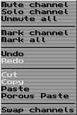

Here, we're covering how to actually use the playlist.

So, let's get started!

# Positioning yourself

You can move around using the playlist movements keybinds, or the mouse.

<!-- TODO: Arrows, tab, PgUp, PgDn, Home and End -->

Mouse movement is done by simply left-clicking to where you want to go!

# Placing notes and effects into the playlist

First and foremost, you need to select the right pattern to edit.
You can do this from [the pattern editing window](./ui.md#pattern-editing-window)
and [the song arranger](./ui.md#the-song-arranger).

Once you've selected a pattern, you can begin inserting notes by hitting `Spc`,
or the `Rec` button in the [general editor buttons window](./ui.md#general-editor-buttons-window).
You should notice that your playhead, as well as the `Rec` button, have changed colors!

Any note you hit on your keyboard, or any note you hit from [the instrument editor](./ui.md#instrument-editor)'s
keyboard while it's in "Playing" mode, will be placed into the playlist.

You can use
any effect named [here](./fx.md#volume-column-effects) in the volume column,
any effect named [here](./fx.md#effect-column-effects) in the effect column.

You can change how by how many rows the cursor moves down after a change by altering the "Add" property in the
[song and editing properties](./ui.md#song-and-editing-properties). If it's 0, the cursor won't move at all!
Naturally, the cursor will move down for a change in any column.

# Working with tracks

You can do the following with tracks:

- Cutting (`Sh+F3`)
- Copying (`Sh+F4`)
- Pasting (`Sh+F5`)

# Working with selections

There are two ways you can make a selection:

1. Holding `Alt` and moving around
2. Using your mouse

Both of these ways of selecting will produce a region.

Once you've made a selection, you can move it around using the mouse, by left-mouse holding it, and moving it.

All of the [track-related functions](#working-with-tracks) can be done using selections:

- Cutting (`Alt+F3`)
- Copying (`Alt+F4`)
- Pasting (`Alt+F5`)

# Effectively using the advanced options

Advanced options that you will most commonly be using are interpolation and volume scaling.

You can read about both [here](./ui.md#advanced-editor).

# Muting and soloing tracks

This is done by opening the playlist dropdown menu, by right-clicking on any track in the playlist.
The dropdown window looks something like this:

Muting is done using the "Mute channel" options.

Soloing the track which was right-clicked (that is, muting everything except that one), is done with the "Solo channel" option.

Unmuting all the tracks is achieved with "Unmute all".

# Swapping tracks

You can move swap the track that the cursor is on with the track you right-clicked on, using the "Swap channel" option in the dropdown.
