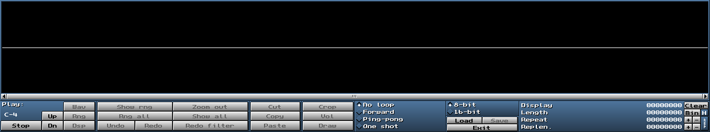

MilkyTracker has a significantly more powerful sample editor, in comparison to its predecesor,
FastTracker II. The features available to you in MT include:

- Creating a new sample with a specified sample size
- Waveform generators for:
	- sine waves,
	- square waves,
	- triangle waves,
	- sawtooth waves,
	- noise
	- silence (which clears the sample)
- Volume boosting, fading and normalizing
- Reversing
- Smoothing
- Equalization
- ProTracker boosting
- Resampling

and some less important features.

Here, we'll be looking at how you can use these features to create and manipulate samples.

# Before we begin

When you open the [sample editor](./ui.md#sample-editor) (using `Ctrl+S` or `Smp. Ed.` from the
[general editor buttons window](./ui.md#general-editor-buttons-window)),
you are greeted with this window:

These UI elements, and their basic functionality, are covered [here](./ui.md#sample-editor).

This document, however, serves to showcase the sample manipulation.

With that in mind, let's proceed.

# Sample manipulation

To begin manipulating a loaded sample, or create a new sample, right-click on the
[sample waveform viewer](./ui.md#sample-waveform-viewer) (the black box which shows the sample).

This will show a drop-down menu of various functionalities you can use.

Those with an arrow expand to more functionalities.

The diagram below serves to highlight all the sample manipulation functionalities:

I'll name each functionality by its name in the drop-down menu.

Keep in mind that **you can make selections by left-click dragging across the sample**!

## New...

Creates a new sample, with the specified sample size.
I usually use 30 for simple waves and 500-1000 for percussion.

## Undo/Redo

Undoes or redoes a change done to the sample.

## Cut/Copy/Paste/Crop

Self-explanatory.

Cut, Copy and Crop require a range selection to be made.
You can make one by right-mouse dragging along a sample **when not in draw mode**.

## Range all

Range selects the entire sample.

## Advanced

Allows more advanced manipulation of an existing sample.

### Volume boost...

Boosts the volume by a given percent.

If a selection is made, makes the change only on the selection.

### Volume fade...

Fades the volume from the starting value to the given value.

If a selection is made, makes the change only on the selection.

### Normalize

Boosts the volume of the sample as far as possible before any clipping occurs.

If a selection is made, makes the change only on the selection.

### Backwards

Reverses the sample.

If a selection is made, makes the change only on the selection.

### Smooth (rect.)/Smooth (tri.)

Rectangular and triangular smoothing.

Smooths out the sample, making the transients smaller and high ends lower.

If a selection is made, makes the change only on the selection.

<!-- MISSING: More info of how the smoothing actually works -->

### 3 Band EQ...

Opens a popup winow which prompts the user with a 3-band equalizer.

The frequency the bands are on are visible above the sliders.

If a selection is made, makes the change only on the selection.

### 10 Band EQ...

Opens a popup winow which prompts the user with a 10-band equalizer.

The frequency the bands are on are visible above the sliders.

If a selection is made, makes the change only on the selection.

### Resample...

Allows resampling the sample to a specific number of samples.

Resampling implies changing the sample count, using fine-tune and relative note settings.

## ProTracker. Boost

Does the ProTracker sample boost.

Effectively, this boosts the volume and high-end.

## Generators

Generates a selected signal sample and places it into the selected sample slot.
Undoable using [Undo](#undoredo).

---

[0. INTRODUCTION](./intro.md)

[1. TRACKER BASICS](./basics.md)

[2. THE XM FILE FORMAT](./xm.md)

[2.1. EFFECT GLOSSARY](./fx.md)

[3. MILKYTRACKER UI REFERENCE](./ui.md)

[3.1. INTERACTIVE UI ELEMENTS](./elems.md)

**3.2. WORKING WITH SAMPLES**
- [Before we begin](#before-we-begin)
- [Sample manipulation](#sample-manipulation)
	- [New...](#new)
	- [Undo/Redo](#undoredo)
	- [Cut/Copy/Paste/Crop](#cutcopypastecrop)
	- [Range all](#range-all)
	- [Advanced](#advanced)
		- [Volume boost...](#volume-boost)
		- [Volume fade...](#volume-fade)
		- [Normalize](#normalize)
		- [Backwards](#backwards)
		- [Smooth (rect.)/Smooth (tri.)](#smooth-rectsmooth-tri)
		- [3 Band EQ...](#3-band-eq)
		- [10 Band EQ...](#10-band-eq)
		- [Resample...](#resample)
	- [ProTracker. Boost](#protracker-boost)
	- [Generators](#generators)

[3.3. WORKING WITH THE PATTERN EDITOR](./playlist.md)

[4. CONFIGURING MILKYTRACKER](./config.md)

[4.1. KEYBIND OPTIONS](./keybind.md)

[5. TIPS AND TRICKS](./tips.md)

[6. GOOD SOURCES](./sources.md)

[7. MAKING AN EXAMPLE SONG IN MILKYTRACKER](./song.md)

[8. THANKS](./thanks.md)

[9. MISSING DOCUMENTATION](./missing.md)
