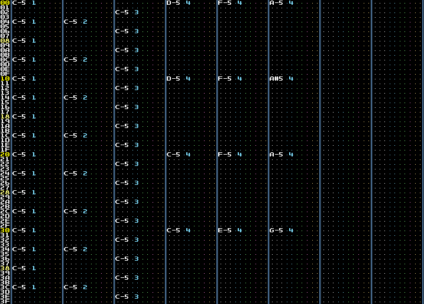
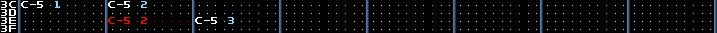

Let's create a basic electro loop using MilkyTracker!

# Setting the song up

Let's set the [BPM](./basics.md#ticks-spd-and-bpm) to 128 using the
[song and editing properties](./ui.md#song-and-editing-properties).

We'll keep the [SPD](./basics.md#ticks-spd-and-bpm) at 6, since it's the standard setting.

We'll also name the song "my first song!", since it feels appropriate! :)

<!-- AVAILABLE AT: ../img/firstSong_1.mp4 -->
https://github.com/bratpeki/modern-milkytracker-guide/assets/44314748/604a2692-396b-4106-b3d2-7d79a12eadc3

---

Now, we'll select instrument 1, and load `kick.wav` into it using the
[disk operations window](./ui.md#disk-operations-window), by selecting the "Type" as "Sample".

All of these samples are available in the `res/samples` folder in the repo.

We'll select instrument 2 either from the [instrument menu](./ui.md#instrument-menu) or by using
the `Sh+DownArrow` keyboard shortcut.

We'll, similarly as for instrument 1, load `snare.wav` in the second instrument slot.

We'll load `closed_hat.wav` into the third instrument slot.

Right-clicking, or double-left-clicking, on the instrument slots in the
[instrument menu](./ui.md#instrument-menu), will let us rename the instruments.

Let's name them "Kick", "Snare" and "Closed hat", respectivelly.

<!-- AVAILABLE AT: ../img/firstSong_2.mp4 -->
https://github.com/bratpeki/modern-milkytracker-guide/assets/44314748/ac7f8a21-5b0d-4db5-ae7d-f447f0d1157d

---

Now, let's generate a synth using the square wave generator.

Let's select instrument 4, open the sample editor using `Ctrl+S`, and
[generate](./samples.md#generators) a new square wave.
We'll do this by generating 32 samples, and a square wave of 1 period, at 25% volume.
We'll set the [looping mode](./ui.md#looping-mode-radio-buttons) to "Forward".

We'll name it "Synth" in the [instrument menu](./ui.md#instrument-menu). Let's also name the
sample "Synth" from the sample menu, just so that we know which slot it is occupying.

<!-- AVAILABLE AT: ../img/firstSong_3.mp4 -->
https://github.com/bratpeki/modern-milkytracker-guide/assets/44314748/6d8a8d97-b2c1-4b59-8eec-ac78f9715e7d

We'll edit instrument 4 in the [instrument editor](./ui.md#instrument-editor), by making the
[Fadeout](./xm.md#fadeout) set to 000, turning the [volume envelope](./xm.md#volume-envelope) on,
and creating a "plucky" sound using a volume falloff. We'll set the volume to 10.

<!-- AVAILABLE AT: ../img/firstSong_4.mp4 -->
https://github.com/bratpeki/modern-milkytracker-guide/assets/44314748/94ef12d1-58dc-442f-8294-8886b15c6c01

---

For the purposes of this example song, we have all the sounds we need!

# Working on pattern 0

Using the [pattern editor](./ui.md#pattern-editor), let's generate a pattern that looks like this:



You can use `Tilde` and `Sh+Tilde` to ajdust [`Add`](./ui.md#add).

You wanna set it to 4.

Make sure wrapping is on by checking the
[common MT options toggle window](./ui.md#common-mt-options-toggle-window).

Hit `Home` to move to the top of the pattern.

Use the arrow keys, `Tab` and `Sh+Tab` to navigate to the first track's first cell's note section.

Then, hold `Q`.
You'll place kicks on each 4th bar of the first track.

You can do the same with the other instruments!

# Adding another pattern

Then, let's clone the pattern, using the
[`CLN` button in the song arranger](./ui.md#the-song-arranger).

Let's just add a snare to the end, like how I've done here.



The change is highlighted in red.

# Arranging the song

Now, let's use the [song arranger](./ui.md#the-song-arranger) so that we have the following song
structure:

```
ORDER | PATTERN
    0 | 00
    1 | 01
    2 | 00
    3 | 01
```

We'll start with this structure:

```
ORDER | PATTERN
    0 | 00
    1 | 01
```

Let's click on the pattern `0 | 00` and then click `Ins.` twice. We'll get the following:

```
ORDER | PATTERN
    0 | 00
    1 | 00
    2 | 00
    3 | 01
```

Then, click on `1 | 00` and the `+` under the `Ins.` button.
We'll get the desired song structure named at the start of the section.

# Saving the song

Now, let's save the song using [the disk operator window]().
We're setting the type to "Module" and saving an XM module.
Let's name the export "my-first-song.xm"!

<!-- AVAILABLE AT: ../img/firstSong_5.mp4 -->
https://github.com/bratpeki/modern-milkytracker-guide/assets/44314748/3b37d94d-3ba1-4d29-9449-1e765c582c59

You can, of course, choose where you'll save the module.
I saved it to the fifth slot in the module part of the disk operator.

# Exporting the song

Now, let's open the [disk operations window](./ui.md#disk-operations-window).
We're setting the type to "Module" and saving a WAV file.
Let's name the export "my-first-song.wav"!

We'll audo-adjust the mixer volume and export.

<!-- AVAILABLE AT: ../img/firstSong_6.mp4 -->
https://github.com/bratpeki/modern-milkytracker-guide/assets/44314748/12076ae2-8d00-457e-99eb-a66896de6fab

You've now successfully made and exported your first MilkyTracker song!

The module will be available in the `res/modules/` folder, so that you can see what it's supposed to sound like!

---

[0. INTRODUCTION](./intro.md)

[1. TRACKER BASICS](./basics.md)

[2. THE XM FILE FORMAT](./xm.md)

[2.1. EFFECT GLOSSARY](./fx.md)

[3. MILKYTRACKER UI REFERENCE](./ui.md)

[3.1. INTERACTIVE UI ELEMENTS](./elems.md)

[3.2. WORKING WITH SAMPLES](./samples.md)

[3.3. WORKING WITH THE PATTERN EDITOR](./playlist.md)

[4. CONFIGURING MILKYTRACKER](./config.md)

[4.1. KEYBIND OPTIONS](./keybind.md)

[5. TIPS AND TRICKS](./tips.md)

[6. GOOD SOURCES](./sources.md)

**7. MAKING AN EXAMPLE SONG IN MILKYTRACKER**

[8. THANKS](./thanks.md)

[9. MISSING DOCUMENTATION](./missing.md)
