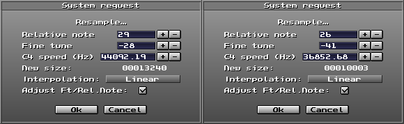

This doc is reserved for giving some tips and tricks that will aid you in using MT, as well as trackers in general!

# Leveling the song

Once all your instruments have been leveled relative to each other,
there's a good chance that your track will clip. You can investigate
this using the [peak meter](./ui.md#song-title-length-and-peak-window--common-mt-options-toggle-window).
If the text next to the peak meter turns red, your song is clipping.

<!-- TODO: Peak meter should have it's own header, covered in another TODO -->

The way this can be resolved is by opening the [HD Recorder window](./ui.md#hd-recorder-window)
and hitting the "AUTO" button. This will show you the mixer level that will
be used for the export.

Then, simply take that number and change the volume of each sample to it.

Now, the song *shouldn't* clip, indepent of the tracker used to play it.

# Chorus

For this one, you would use the [EDx note delay effect]()!

Let's say we have a track playing one instrument, like so:

```
| TRACK 1             |
|---------------------|
| C-4 | .1 | .. | ... |
| ... | .. | .. | ... |
| ... | .. | .. | ... |
| ... | .. | .. | ... |
| ... | .. | .. | ... |
| ... | .. | .. | ... |
| ... | .. | .. | ... |
| ... | .. | .. | ... |
| ... | .. | .. | ... |
| ... | .. | .. | ... |
| ... | .. | .. | ... |
| ... | .. | .. | ... |
```

We create a "chorus" like effect by adding more instances of the instrument, spacing them out over a small distance, like so:

```
| TRACK 1             | TRACK 2             | TRACK 3             |
|---------------------|---------------------|---------------------|
| C-4 | .1 | .. | ... | C-4 | .1 | .. | ED1 | C-4 | .1 | .. | ED2 |
| ... | .. | .. | ... | ... | .. | .. | ... | ... | .. | .. | ... |
| ... | .. | .. | ... | ... | .. | .. | ... | ... | .. | .. | ... |
| ... | .. | .. | ... | ... | .. | .. | ... | ... | .. | .. | ... |
| ... | .. | .. | ... | ... | .. | .. | ... | ... | .. | .. | ... |
| ... | .. | .. | ... | ... | .. | .. | ... | ... | .. | .. | ... |
| ... | .. | .. | ... | ... | .. | .. | ... | ... | .. | .. | ... |
| ... | .. | .. | ... | ... | .. | .. | ... | ... | .. | .. | ... |
| ... | .. | .. | ... | ... | .. | .. | ... | ... | .. | .. | ... |
| ... | .. | .. | ... | ... | .. | .. | ... | ... | .. | .. | ... |
| ... | .. | .. | ... | ... | .. | .. | ... | ... | .. | .. | ... |
| ... | .. | .. | ... | ... | .. | .. | ... | ... | .. | .. | ... |
```

You can also just have a high BPM or small Speed and do the following:

```
| TRACK 1             | TRACK 2             | TRACK 3             |
|---------------------|---------------------|---------------------|
| C-4 | .1 | .. | ... | ... | .. | .. | ... | ... | .. | .. | ... |
| ... | .. | .. | ... | C-1 | .1 | .. | ... | ... | .. | .. | ... |
| ... | .. | .. | ... | ... | .. | .. | ... | C-4 | .1 | .. | ... |
| ... | .. | .. | ... | ... | .. | .. | ... | ... | .. | .. | ... |
| ... | .. | .. | ... | ... | .. | .. | ... | ... | .. | .. | ... |
| ... | .. | .. | ... | ... | .. | .. | ... | ... | .. | .. | ... |
| ... | .. | .. | ... | ... | .. | .. | ... | ... | .. | .. | ... |
| ... | .. | .. | ... | ... | .. | .. | ... | ... | .. | .. | ... |
| ... | .. | .. | ... | ... | .. | .. | ... | ... | .. | .. | ... |
| ... | .. | .. | ... | ... | .. | .. | ... | ... | .. | .. | ... |
| ... | .. | .. | ... | ... | .. | .. | ... | ... | .. | .. | ... |
| ... | .. | .. | ... | ... | .. | .. | ... | ... | .. | .. | ... |
```

The first one is a bit more optimal, because with a higher BPM or smaller Speed, you have less "time" in your track.
In Layman's terms, your pattern is 4 times shorter, time-wise, when you lower the Speed from 4 to 1, or increase the BPM from 100 to 400.
In any case, either of the two methods work!

# Delay

Usually, the way you would do delay is to
**create copies of the sound, at a constant distance, making each instance quieter**.

If you have a very short sound, delay could look something like this:

<!-- Do the TRACK 1, 2, ... for each of these! -->

```
| TRACK 1             |
|---------------------|
| C-4 | .1 | 40 | ... |
| ... | .. | .. | ... |
| C-4 | .1 | 30 | ... |
| ... | .. | .. | ... |
| C-4 | .1 | 20 | ... |
| ... | .. | .. | ... |
| C-4 | .1 | 10 | ... |
| ... | .. | .. | ... |
| C-4 | .1 | 08 | ... |
| ... | .. | .. | ... |
| C-4 | .1 | 04 | ... |
| ... | .. | .. | ... |
```

If an instrument is longer, this might cut the previous sound off.
In that case, you can space these out like this:

```
| TRACK 1             | TRACK 2             |
|-------------------------------------------|
| C-4 | .1 | 40 | ... | ... | .. | .. | ... |
| ... | .. | .. | ... | ... | .. | .. | ... |
| ... | .. | .. | ... | C-4 | .1 | 30 | ... |
| ... | .. | .. | ... | ... | .. | .. | ... |
| C-4 | .1 | 20 | ... | ... | .. | .. | ... |
| ... | .. | .. | ... | ... | .. | .. | ... |
| ... | .. | .. | ... | C-4 | .1 | 10 | ... |
| ... | .. | .. | ... | ... | .. | .. | ... |
| C-4 | .1 | 08 | ... | ... | .. | .. | ... |
| ... | .. | .. | ... | ... | .. | .. | ... |
| ... | .. | .. | ... | C-4 | .1 | 04 | ... |
| ... | .. | .. | ... | ... | .. | .. | ... |
```

You might need more tracks and more space, that all depends on the sound!

<!-- TODO: Maybe these should be headers, and not listitems? -->
The ["Split track options" section of the Advanced editor](./ui.md#advanced-editor) might help you with this.

# Sample chopping

There's multiple approaches to chopping a sample in MT.

## Using 9xx

You can use the [`9xx` effect](./fx.md#9xx-sample-offset) to chop a sample.

As stated in the
["Sample waveform viewer" section of "3. MILKYTRACKER UI REFERENCE](./ui.md#sample-waveform-viewer),
you can use `Ctrl` in the waveform viewer to view the `9xx` offsets!

If your sample is more than 255 `9xx` offset blocks, and you need to reach those offset blocks
which `9xx` doesn't let you reach, you might have to resample the sample down, so that it
fits in the 255 offset blocks.

You can use ["Resample..."](./samples.md#resample) for this:



You're aiming to set the new size to cca. 10000.

This can, of course, destroy audio quality, but you can undo it using ["Undo"](./samples.md#undoredo).

## Chop the sample into instruments

You can load the sample into multiple instruments, and then [crop](./ui.md#crop-button) different
sections for each instrument.

## Chop the sample into samples of one instrument

This method involves loading the sample into multiple [sample slots](./ui.md#sample-menu) of one
instrument, and then cropping those.

Then, you use the [instrument editor keyboard](./ui.md#keyboard) to assign the notes to the sample
slots.

This method has the advantage of exporting the instrument as an XI instrument file, which you can
send to other people or reuse!

---

[0. INTRODUCTION](./intro.md)

[1. TRACKER BASICS](./basics.md)

[2. THE XM FILE FORMAT](./xm.md)

[2.1. EFFECT GLOSSARY](./fx.md)

[3. MILKYTRACKER UI REFERENCE](./ui.md)

[3.1. INTERACTIVE UI ELEMENTS](./elems.md)

[3.2. WORKING WITH SAMPLES](./samples.md)

[3.3. WORKING WITH THE PATTERN EDITOR](./playlist.md)

[4. CONFIGURING MILKYTRACKER](./config.md)

[4.1. KEYBIND OPTIONS](./keybind.md)

**5. TIPS AND TRICKS**
- [Leveling the song](#leveling-the-song)
- [Chorus](#chorus)
- [Delay](#delay)

[6. GOOD SOURCES](./sources.md)

[7. MAKING AN EXAMPLE SONG IN MILKYTRACKER](./song.md)

[8. THANKS](./thanks.md)

[9. MISSING DOCUMENTATION](./missing.md)
