<!--

On a side note, I decided to use the following formatting rule here:

# is reserved for windows.
## is reserved for sections of windows.
### is reserved for buttons, text fields, etc.

-->

Here, we'll be covering the MT's UI and how to navigate around it.

I'll use shortcuts to indicate keyboard actions, such as `Ctrl+S`. Keep in mind that:
- `Ctrl` is the control key,
- `Sh` is the shift key,
- `Spc` is the space bar and
- `Alt` is, well, the alt key!

**All the listed keyboard actions apply to the FastTracker II edit mode**.

Also, left-, right- and middle-clicking, as well as left-, right- and middle-click holding will
refer to their respective mouse actions.

**Before you read this**, you might want to read about the interactive UI elements in MT that are
covered in "[3.1. INTERACTIVE UI ELEMENTS](./elems.md)".

Working with the pattern editor and sample editor are mostly covered in separate docs, that being
["3.2. WORKING WITH SAMPLES"](./samples.md) and
["3.3. WORKING WITH THE PATTERN EDITOR"](./playlist.md),
because of how much there is to write.

There's a lot of text here to, but consider **ONLY READING WHAT YOU DON'T KNOW OR UNDERSTAND**.
**YOU CAN SKIP THIS DOC AND MOVE ON TO** "[7. MAKING AN EXAMPLE SONG IN MILKYTRACKER](./song.md)"!

# Startup

Upon first startup, you are going to be greeted by the MT splash screen:


Afterwards, MT loads the [main window](#main-window).

The startup splash screen is easily disabled in the
[settings](./config.md) ([`Misc. > Other > Splash screen`](./config.md#splash-screen)).

# Main window

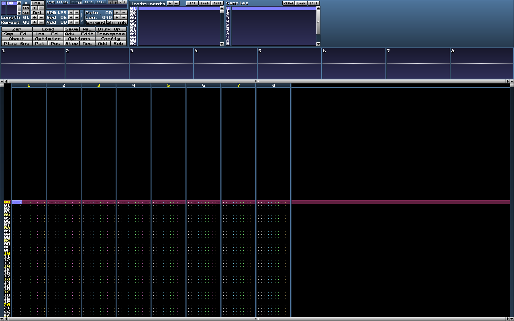

This is the only real GUI window in MT, all other "windows" that I refer to are just subwindows
within the main window.

From here, you will be managing everything, from modules to the way your tracker works and looks.

You can always return to the main window by hitting `Ctrl+X`.

The elements in this window, from top-left to bottom-right, are:

1. [The general editor](#general-editor)
2. [The instrument menu](#instrument-menu)
3. [The sample menu](#sample-menu)
4. [The scopes](#scopes)
5. [The pattern editor](#pattern-editor)

## Tabs

MT can open multiple module instances, in the form of tabs.

A new tab with an empty module, called `Untitled.xm`, is opened using `Ctrl+Sh+T` and the current
one is closed using `Ctrl+Sh+W`. You can select the active tab by clicking on it from the tab bar,
at the bottom of the main window. You can also use the `+`/`-` buttons on the left side of the tab
bar to open an empty tab or close the current one.

<!-- TODO: Tab bar image? -->

# General editor

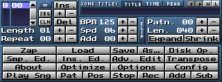

The general editor is the top-left window visible from the [main window](#main-window).

From here, you'll manage various properties relating to your song, your editing of the song, as
well as toggle other windows.

You can return to this window by either hitting `Exit` on the windows that take its place (like the
[disk operations window](#disk-operations-window), [transposition window](#transposition-window),
etc) or by going back to the main window with `Ctrl+X`.

The elements in this window, from top-left to bottom-right, are:

1. [The song arranger](#the-song-arranger)
2. [Song title, length and peak window + Common MT options toggle window](#song-title-length-and-peak-window--common-mt-options-toggle-window)
3. [Song and editing properties](#song-and-editing-properties)
4. [Pattern properties window](#pattern-properties-window)
5. [General editor buttons window](#general-editor-buttons-window)

## The song arranger

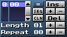 Regular view.<br>
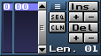 Expanded view.

This window is used to arrange the patterns you've created into the final song.

### Pattern sequence display

Allows you to view the song order number (in hex) and the pattern number (in hex), one next to the
other. In a new module, you have the pattern `00` set to order `0`.

### Pattern sequence display expansion button

This button is above the `SEQ` button and allows you to hide the song pattern length and repeating
song order. This, in turn, expands the pattern sequence display further down, and allows for more
readability. Hitting the button toggles this behaviour on and off. The example of this behaviour is
above, on the second image of the section.

### "SEQ" button

Adds a new pattern after the current one, if possible, so that its pattern number is the
incremented previous pattern number. So, if your pattern sequence is:

```
0 | 00
```

By hitting `SEQ` you will generate the following sequence:

```
0 | 00
1 | 01
```

If the current pattern in the sequence has the pattern number `FF`, the next one will be `00`, as
well as every pattern after that next one.

### "CLN" button

Works the same way as the `SEQ` button, except that it copies the content of the current pattern
into the next one.

### "Ins." button

Inserts the current pattern at the next song order number.
The button has no effect if there are 255 patterns in the song.

### "Del" button

Deletes the pattern from the current song order number and moves the next pattern into the deleted
slot. If there are no patterns after the deleted one (that is, if we deleted the last one) we just
move back one song order to the previous pattern. The button has no effect if there's only one
pattern in the song.

### "+"/"-" buttons between "Ins." and "Del"

Increments or decrements the number of the pattern at the current song order.

### "+"/"-" buttons next to the song pattern length

Adds a new pattern to the end of the song, or removes a pattern from the end of the song.
In case a new pattern is added, its pattern number is `00`.
The `+/-` buttons next to the song pattern length in the exapnded view have the same effect.

### "+"/"-" button next to the repeating song order

Increments or decrements the repeating song order.

## Song title, length and peak window + Common MT options toggle window

<br>
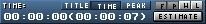<br>


### "TITLE", "TIME" and "PEAK" tabs

Allows the selection of which of those three things you want to look at.

### Song title text field tab

Contains a text input field which changes the title of your song.
By default, the song title is an empty string.

### Song length tab

Allows viewing the current time (hour:minute:second) that has elapsed since the module started
playback, and the total time. By default, in an empty startup module, the text in the tab reads
`00:00:00 (00:00:07)`. The `ESTIMATE` button estimates the total length of the song and updates the
song length. You usually have to click this button manually, but you can have MT estimate the time
for you once the module is loaded, by ticking a checkbox in the settings
(`Misc. > Other > ESTIMATE PLAYTIME AFTER LOAD`).

### Song peak meter tab

Reads the intensity of the sound generated by the playback. As per default, the peak meter is split
into the left signal (left of center) and right signal (right of center), as well as the quiet
(green), sufficient (yellow) and loud (red) areas. If the song clips, the `PEAK LEVEL:` text above
the peak meter will turn red. Right-clicking it resets it back to its default color, white.

### Common MT options toggle window

This window consists of four buttons labeled `F`, `P`, `W` and `L`, in that order.
Right-clicking these toggles their respective options.
The options are:

| Label | Keyboard shortcut | Name of the action, taken from the MT manual | Description |
| -     | -                 | -                                            | - |
| `F`   | `Ctrl+F`          | Song follow                                  | If on, the cursor follows the playhead. |
| `P`   | `Ctrl+P`          | Prospective pattern view                     | If on, the previous and next patterns in the song are visible. |
| `W`   | `Ctrl+W`          | Pattern wrapping                             | If on, during editing of a pattern, the cursor will wrap and stay on the current pattern, instead of moving to the next or previous one. |
| `L`   | `Ctrl+L`          | Pattern change behaviour (live mode)         | If on, when you change the current pattern while another pattern is playing, it will first play the current one entirely, and then move on to the next one. If off, the pattern change happens immedietly, without wait. Used in live performances. |

## Song and editing properties

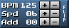 Regular.<br>
 Flipped view.

This window consists of a couple properties related to the song and how you edit it.
The `+/-` buttons are placed next to their respective properties.
The `FLIP` button flips the display to show the rest of the editable properties.

### BPM

The song's [BPM](./basics.md#ticks-spd-and-bpm).

### Spd

The song's [SPD](./basics.md#ticks-spd-and-bpm).

### Add

The ammount by which your cursor moves down after placing a note or effect. The cursor loops if
pattern wrapping (`Ctrl+W`) is on.

### Oct

The octave of the notes you place (ex. if `Oct` is equal to `04`, then the lowest key you can place
with your keyboard is C4).

### The "Mainvol" property

Shows you the [global song volume](./xm.md#global-song-volume).

## Pattern properties window


### "+"/"-" buttons next to "Patn."

Switch between different patterns.

### "+"/"-" buttons next to "Len."

Increase or decrease the pattern length.
This action is desctructive; in case you shorten the pattern so certain notes disappear, they
cannot be brought back by increasing the pattern length. You can, however, bring them back by
undoing your changes (`Ctrl+Alt+Z`).

### "Expand" button

Doubles the pattern length, by inserting an empty pattern line on each second line
(line 1 - empty line - line 2 - empty line - ...).

### "Shrink" button

Halves the pattern length, by deleting even second line (line 1 - line 3 - line 5 - line 7...).
This action is desctructive; expanding a shrinked pattern will not bring back notes that were
removed. You can, however, bring them back by undoing your changes (`Ctrl+Alt+Z`).

## General editor buttons window

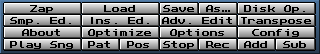

- [`Zap` - Zapper](#zapper-window)
- `Load` - "Load module", opens a popup window to find the module you want to load
- `Save` - "Save module", saves the module, behaves like "Save module as..." if the module wasn't saved before
- `As...` - "Save module as...", opens a popup to choose the location and name of the module you are saving
- [`Disk Op.` - Disk operations window](#disk-operations-window)
- [`Smp. Ed.` - Sample editor](#sample-editor)
- [`Ins. Ed.` - Instrument editor](#instrument-editor)
- [`Adv. Edit` - Advanced editor](#advanced-editor)
- [`Transpose` - Note trasposition](#transposition-window)
- [`About` - About MT](#about-window)
- [`Optimize` - Module optimization](#optimization-window)
- [`Options` - Quick options](#quick-options-window)
- [`Config` - MT configuration](#configuration-window)
- `Play Sng` - Play the entire song
- `Pat` - Play pattern
- `Pos` - Play from cursor position
- `Stop` - Stop playback
- `Rec` - Toggle recording (editing)
- `Add` - Add tracks
- `Sub` - Subtract (Remove) tracks

The options which don't link to a heading do the following:

| Option     | Description |
| -          | - |
| `Save`     | Save the module by owerwriting the module you loaded. If the module is the default empty one that MT loads up with (`Untitled.xm`), this button works the same as [`As...`](). |
| `Play Sng` | Play the module, from the beginning of the current pattern. Same as `Right Ctrl`. |
| `Pat`      | Play the current pattern indefinitely, starting from the beginning. Same as `AltGr` (`Right Alt`). |
| `Pos`      | Play the current pattern indefinitely, starting from the cursor position. Same as `Sh+Enter`. |
| `Stop`     | Stop the playback. Same as `Spc`, when the module is playing. |
| `Rec`      | Toggle the recording mode. Same as `Spc`, when the module is not playing. |
| `Add`      | Adds 2 tracks to the song. Can't add more than the maximum value set in the settings (`I/O > XM channel limit`). |
| `Sub`      | Subtracts 2 tracks from the song. Can't subtract when there are 2 tracks, because that makes the number of tracks 0, duh! This action is not desctructive until you save and reload the module. |

# Instrument menu

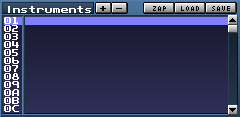

Allows selection of the active instrument. The active instrument is selected by left- or
right-clicking on the ID slot or left-clicking the name slot text input field of the instrument. The
user can also change the active instrument by hitting `Sh+UpArrow` (setting the previous instrument
as the active one) or `Sh+DownArrow` (setting the next instrument as the active one). The active
instrument is displayed in the [instrument editor](#instrument-editor), as well as being the
instrument which is set for inserting notes into the [pattern editor](#pattern-editor).

### "Instruments" text field

Hides the active instrument highlight. Useful for making the text in the instrument slot more
readable.

### "+"/"-" buttons

Add or remove one instrument. Non-desctructive action, unless you save the file without the removed
instruments.

### "ZAP" button

Clears the instrument (samples and instrument settings).

Destructive action. Opens a warning popup window.

### "LOAD" button

Loads an XI instrument from memory. Opens a popup window.

### "SAVE" button

Saves an XI instrument to memory. Opens a popup window.

### Scrollbar

Used to navigate the instrument slots. Mouse-scrolling does the same thing.

# Sample menu

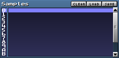

Allows selection of the active sample of the active instrument. The active sample is selected by
left- or right-clicking on the ID slot or left-clicking the name slot text input field of the
sample. The user can also change the active sample by hitting `Ctrl+Sh+UpArrow` (setting the
previous sample as the active one) or `Ctrl+Sh+DownArrow` (setting the next sample as the active
one). The sample in the [sample editor](#sample-editor) is the currently active one.

### "CLEAR" button

Clears the active sample.

Destructive action, not undoable using `Ctrl+Alt+Z`. Doesn't open a warning popup window.

### "LOAD" button

Loads a WAV file from memory into the active sample.

### "SAVE" button

Saves a WAV file of the active sample to memory.

### Scrollbar

Used to navigate the sample slots. Mouse-scrolling does the same thing.

# Instrument editor

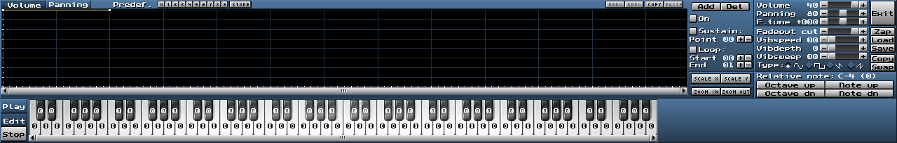

Allows editing of the currently selected instrument (via the [instrument menu](#instrument-menu)).
Can be toggled by hitting `Ctrl+I`.

### Envelope viewer

Displays the volume or panning envelope of the instrument.
Special actions include left-clicking, which moves the envelope points, and right-clicking, which
opens a drop-down menu which allows copying and pasting, as well as scaling the envelope.

### "Volume"/"Panning" tabs

Used to edit either the volume or panning envelope.

### "0"-"9" and "STORE" buttons

Used to load of store of the predefined envelopes.
The used can predefine 20 envelopes, 10 for volume and 10 for panning.
The predefined envelopes are loaded by hitting the numerical buttons, and storing is done by
hitting the `STORE` button first, after which the user hits the numerical buttons.

### "UNDO"/"REDO" buttons

Undo or redo the envelope changes.

These include all the envelope editing actions right of the `UNDO`/`REDO` buttons,
that being adding or removing points from the envelope (via the `Add`/`Del` buttons),
toggling the envelope on or off (via the `On` button),
toggling the sustain on or off, or changing which point is the sustain point (via the `Sustain`
button and the `+`/`-` buttons under it), toggling the loop on or off, of chaning the start and end
point (via the `Loop` button and the `+`/`-` buttons under it) and scaling the envelope, that is
multiplying it by a given percentage (via the `SCALE X`/`SCALE Y` buttons).

### "COPY"/"PASTE" buttons

Copy or paste the envelope (indepent of which type of envelope it is) into another envelope.

### "ZOOM IN"/"ZOOM OUT" buttons

Zoom in or out of the envelope.

### Right-most part of the window

Used for editing the basic instrument properties, which are described [here](./xm.md#instruments).
There are still certain buttons of interest, described below.

### "Exit" button

Close the instrument editor window. Same as hitting `Ctrl+I`.

### "Zap" button

Zap the instrument. Cannot be undone.

### "Load" button

Load an instrument from memory.

### "Save" button

Save an instrument into memory.

### "Copy" button

Copy a sample from one sample slot in one instrument into another sample slot in another instrument.
Overrides the sample in the destination sample slot, if one exists.
Opens an external window, seen below.

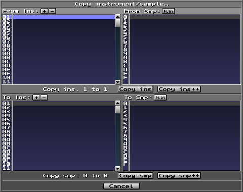

### "Swap" button

Swap a sample from one sample slot in one instrument with another sample slot in another instrument.
Opens an external window, seen below.


### Keyboard

Allows either playing the instrument, or setting which key triggers which sample slot. Playing the
instrument is done by hitting `Play`, after which the keyboard is playable. Setting which key
triggers which sample slow is done by hitting `Edit`. `Stop` stops all instrument playback, either
from playing the keyboard, which is usually neccessary when the user has set a long fadeout, or
playing the actual song. The graphical look of the keyboard's two modes are seen below.

<br>
"Playing" mode.<br>
<br>
"Editing" mode.

# Sample editor

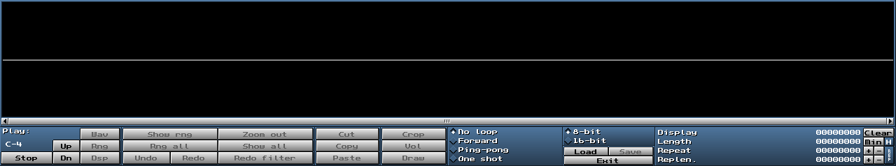

Allows editing of the currently selected sample (via the [sample menu](#sample-menu)).
Can be toggled by hitting `Ctrl+S`.

### Sample waveform viewer

Displays the sample. Largest part of the sample editor.

Special actions include
[shift-left-clicking, left-clicking, right-clicking and scrolling](./keybind.md#sample-editor).
Right-clicking, specifically, opens the
[sample manipulation drop-down](./samples.md#sample-manipulation), which is covered in
"[3.2. WORKING WITH SAMPLES](./samples.md)".

You can hold `Ctrl` when your mouse is inside the sample waveform viewer to view the
`9xx` offset regions! This is pretty useful for chopping samples.

### "Play:" text field

Indicates which note will play when using `Wav`, `Rng` and `Dsp`. The note is displayed below the
text field.

### "Stop" button

Stops sample playback.

### "Up"/"Dn" buttons

Change the note that will play when using `Wav`, `Rng` and `Dsp`.

### "Wav" button

Plays the entire sample on the note shown in the "Play:" text field.
Accounts for looping.

### "Rng" button

Plays the selected sample range on the note shown in the "Play:" text field.
Does not account for looping.

### "Dsp" button

Plays the sample range displayed in the sample viewer on the note shown in the "Play:" text field.
Does not account for looping.

### "Show rng" button

Set the sample viewer in such a way that it displays the selected range.
There is usually padding around the displayed range.

### "Rng all" button

Set the range to be the entire sample.

### "Undo"/"Redo" buttons

Undo or redo the changes done to the sample.
The user can go back 15 steps.

### "Zoom out" button

Zoom out of the sample by 200%.

### "Show all" button

Zoom out entirely.

### "Redo filter" button

Reapply the last change done to the same (generators, EQ, volume change, etc).

### "Cut"/"Copy"/"Paste" buttons

Work as expected, providing the ability to cut, copy and paste parts of the sample into other
sample slots.

Selecting a range in the sample editor, by holding the left mouse button, and pasting results in
the selected section of the sample being swapped for the cut/copied section.

Cutting is undoable using [Undo](./samples.md#undoredo).

### "Crop" button

Swaps the current sample for the range you have selected in it.

Undoable using `Ctrl+Alt+Z`.

### "Vol" button

Opens a popup window which lets you input a number.
Hitting `OK` in the popup window sets the amplitude of the sample to the input number, in percent.
The input number can go over 100, and below 0.
Going below 0 reverses the polarity of the waveform.

### "Draw" button

Toggles the draw mode on the sample.

When the button is pressed, any left-mouse action overrides the current sample data, placing the
waveform point there where the user has pressed. **You can also toggle drawing by holding** `Sh`
**and pressing the same button**.

Undoable using `Ctrl+Alt+Z`.

### Looping mode radio buttons

Allows setting if and how the sample will loop between the set loop points.
The options include **No loop**, **Forward**, **Ping-pong** and **One shot**
and have been covered [here](./xm.md#samples).

### 8-bit and 16-bit radio buttons

Used for coverting the sample between 8-bit and 16-bit.

### "Load" and "Save" buttons

Load the sample from memory or save the current sample to memory, respectively.

### "Exit" buttons

Closes the sample editor. Duh!

### Text boxes on the far right

These showcase the length of the display, length of the sample, where the looping segment starts
and how long the looping segment is.

### "Clear" button

Clears the sample, setting it's length back to 0.

### "Min" button

Removes everything after the loop end point.

### "+"/"-" button pair

If the "REP"/"RNG" button reads "REP":

- The button pair next to "Repeat" moves the loop start point.
- The button pair next to "Replen." moves the loop end point.

If the "REP"/"RNG" button reads "RNG":

- The button pair next to "RStart" moves the sample selection start.
- The button pair next to "REnd" moves the sample selection end.

`+` moves the points forward by 1, `-` moves them back by 1.

### "H"/"D"/"T" button

Toggles hex, decimal or timed display of the text boxes.

### "REP"/"RNG" button

If "REP" is displayed, the information next to the button relates to the loop points.

If "RNG" is displayed, the information next to the button relates to the sample selection.

# Disk operations window

Allows the user to perform reading and writing operations to their hard memory.

It comes in two views, which we'll call the ["list"](#list-view) and ["simple" view](#simple-view).
You can change the active view by hitting `FLIP` in the top-right corner.

Opened with `Ctrl+D`.

## "List" view

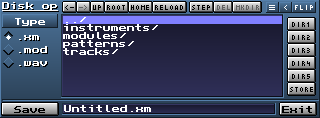

Allows reading or loading files of a specific type by hitting the `Type` button under the "Disk op"
text field. Once you hit the `Type` button, you must select what type you want to write or load.
The types from which you can select a file type are:

1. Modules (`Modules`, saves the module)
2. Instruments (`Instr.`, saves the selected instrument)
3. Samples (`Sample`, saves the selected sample)
4. Patterns (`Patt.`, saves the currect pattern)
5. Tracks (`Track`, saves the track your cursor is on)

By default, the type is set to modules.

Under the `Type` button are radio buttons which allow you to select in which format you are saving
the file. For modules, selecting `.wav` will allow you to export the module to a lossless WAV audio
file.

The buttons right of the "Disk op" text field allow the following actions, from left to right:

1. (`<-`) Moving to the previous directory, up until the first directory that was opened in the disk operations window
2. (`->`) Undoing the move to the previous directory
3. (`UP`) Moving to the parent directory
4. (`ROOT`) Moving to the root directory
5. (`HOME`) Moving to the home directory
6. (`RELOAD`) Refreshing the current directory
7. (`STEP`) Stepping back one directory (similar to #3)
8. (`DEL`) Deleting the selected file (which can be of any type)
9. (`MKDIR`) Making a new directory in the current directory
10. Toggling additional options
11. (`<`/`>`) Toggling the saved directories tab
12. (`FLIP`) Toggling the two views of the disk operations window

In the center of the view is a listview which lets you select the file you want to load into the
module, or go to a directory.

If the saved directories tab is toggled, there are six additional buttons; five for directory paths
(`DIR1` through `DIR5`) and one for storing them (`STORE`). By hitting any of them, you will load
your saved directories. They are not shared for any type of file (for example, the module type and
sample type have different saved directory paths). If you want to store the path to the directory
you are currently in, you can do so by hitting `STORE`, and then hitting the button of the slot you
want to save the path to.

The `Save` button saves the file in the selected directory, unless you've chosen to output a WAV
file. In that case, the button opens the [HD Recorder window](#hd-recorder-window).
The `Exit` buttons returns you to the [general editor](#general-editor).

## "Simple" view

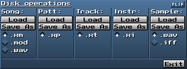

Allows quick selection of format and saving to disk.

Hitting the `Save As` button opens a popup window that allows selection the directory to which you
will save, unless you've selected `.wav`, in which case you'll first be prompted with the
[HD Recorder window](#hd-recorder-window), and then the popup window.

As with the ["List" view](#list-view), the `Exit` buttons returns you to the
[general editor](#general-editor).

## HD Recorder window

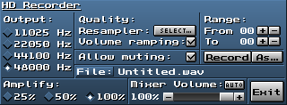

Allows selecting the basic properties of the WAV file you are recording from the module.

These options include, from top-left to bottom-right:

- The sample rate (11025Hz, 22050Hz, 44100Hz, 48000Hz)
- Resampling interpolation (The `SELECT...` button)
- "Volume ramping" (An "anti-clicking" algorithm applied during the mixing phase)
- Range
- "Allow muting" (Keep the muted tracks muted in the export)
- The export destination location (`File:` \ `Samp:` button)
- Amplification of the export
- Mixer volume

### "SELECT..." button

Allows setting the resampler used during exporting.

### "Record" button

Records the export to the destination directory.

### "As..." button

Allows setting the export destination location. Doesn't work for exports into instruments.

### "AUTO" button

Auto-adjusts the mixer volume, a percentage by which the final amplitude of the export is
multiplied, so that the export doesn't clip.

### "Exit" button

Leaves the window.

### "File:"/"Samp:" button

Toggles exporting to a file, or a sample slot of an instrument of the opened module.
If sample exporting is selected, changing the active instrument and sample changes the output
instrument and sample slot of the export.

### Radio buttons under the "Output:" text field

Allow for selecting the sample rate.

### Radio buttons under the "Amplify" text field

Mulitply the export amplitude by the given value.

# Pattern editor

The pattern editor is the window where you write notes and effects, making it the window in with you
actually create the individual [patterns](./xm.md#patterns).

The actual process of editing a pattern, including the keyboard shortcuts and UI behaviour are
described in "[3.3. WORKING WITH THE PATTERN EDITOR](./playlist.md)".

# Scopes

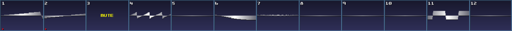<br>
Example, where the first two tracks are armed for recording, and the third is muted.

Displays the sound created by the corresponding track.

Left-clicking mutes and un-mutes the track, as indicated by "MUTE" in the scope.
Right-clicking arms and un-arms a track for recording, as indicated by the red dot in scope.

You can change how the scopes look in the settings (`Misc. > Other > Scope style:`).

Toggled with `Ctrl+Z`.

# Transposition window

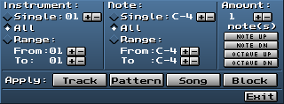

Allows transposing of the notes in the pattern editor.

By default, all notes of all instruments can be transposed. This can be changed with the settings
under the "Instrument:" and "Note:" text fields. "Amount" specifies by how many semitone the
note is moved up or down. The `NOTE UP`, `NOTE DOWN`, `OCTAVE UP` and `OCTAVE DOWN` buttons set
the semitone offset to `+1`, `-1`, `+12` and `-12`, respectively.

The buttons next to "Apply:" let you specify what you want the transposition to be applied to.

Opened with `Ctrl+T`.

<!-- American pronounciations? Behaviour, ammount? -->

# Zapper window

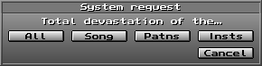

A popup window which, as suggested, removes every piece of data of a certain type from the module.
The options include:

- `All`: Closes the opened module and creates the started module `Untitled.xm`.
- `Song`: Delete all pattern and song order data.
- `Patns`: Delete all the note and effect data of the current pattern.
- `Insts`: Delete the data of all the instruments.

Undoable using `Ctrl+Alt+Z`.

# Quick options window

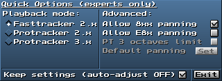

Allows setting how the module will be played back.
Opened with `Ctrl+O`.

The playback modes include:

- `Fasttracker 2.x` (intended from XMs) and
- `Protracker 2.x`/`Protracker 3.x` (intended for MODs)

The additional options on the right include:

- Toggling which panning effects will be functional (useful for MODs made in ProTracker)
- Setting the octave limits to be like in ProTracker 3 (`B-2` - `A-5`), and
- The default panning for each track

The default panning refers to the fact that, on the Amiga, ProTracker panned each track either
far-left or far-right.

The default panning window looks like this:

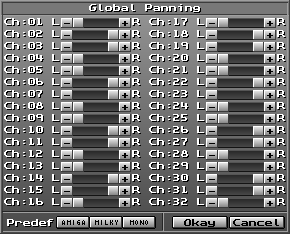

The three presets for the default panning are in the bottom-left corner and include:

1. `AMIGA` (The panning follows the pattern of far-left, then far-right, then far-right, then far-left)
2. `MILKY` (The panning follows the pattern of 50% left, then 50% right)
3. `MONO` (No panning)

# Configuration window

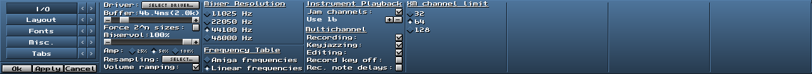

Configures MT's appearance and behaviour.
Opened with `Ctrl+C`.

Features the following tabs (toggled by the buttons with the following text):

- `I/O` (Sound-related settings)
- `Layout` (Colors, resolution, visual settings)
- `Fonts` (Font size and face settings)
- `Misc.` (Editor preferences, scrolling style, edit mode, scope style, etc)
- `Tabs` (Tab-related settings)

The buttons labeled `<`/`>`, which are next to each of the aforementioned buttons, shift the
configuration subwindows left/right by one, in case your GUI window size is too small.

The buttons below the tabs are:

- `Ok` (Applies the changes and closes the configuration window)
- `Apply` (Applies the changes without closing the configuration window)
- `Cancel` (Closes the configuration window without applying any of the made changes)

An in-depth look at configuring MT is given in "[4. CONFIGURING MILKYTRACKER](./config.md)".

# Optimization window

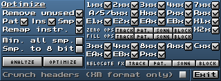

Allows many functionalities aimed at optimizing the file-size of the module.

The functionalities are:

- Removing the patterns (`Pat`), instruments (`Ins`) and samples (`Smp`) which weren't used in the song. `Remove unused` has to be ticked first.
<!-- MISSING: - `Remap instr.` -->
- Trimming the silence off samples (`Min. all smp.`).
- Converting the samples from 16-bit to 8-bit (`Smp. to 8 bit`).

`ANALYZE` will open a popup window showing you the changes that would take place when you optimize
the track, with your selected optimizations. `OPTIMIZE` would optimize the track, with your
selected optimizations.

`Crunch headers (XM format only)` is a, currently, non-implemented functionality.

The matrix-like assortment of effect-column effect, ranging from `1xx` to `X2x`, alters the effects
in such a way that they do or don't use the effect memory.
Effect memory was talked about [at the start of 2.1. EFFECT GLOSSARY](./fx.md).
So, let's say `3xx` is ticked, and the pattern looks like this:

```
| C-4 | .1 | .. | 320 |
| ... | .. | .. | 320 |
| ... | .. | .. | 320 |
| D#3 | .1 | .. | ... |
| D#4 | .1 | .. | 390 |
| ... | .. | .. | 300 |
| ... | .. | .. | 300 |
```

Applying the `ZERO OPS` (zero operators, such as `300`, `300`, ...) change on the track (`TRACK`),
we get this:

```
| C-4 | .1 | .. | 320 |
| ... | .. | .. | 300 | These now use the effect memory
| ... | .. | .. | 300 |
| D#3 | .1 | .. | ... |
| D#4 | .1 | .. | 390 |
| ... | .. | .. | 300 |
| ... | .. | .. | 300 |
```

Applying the `FILL OPS` (fill operators, such as `320`, `320`, ...) change on the track (`TRACK`),
we get this:

```
| C-4 | .1 | .. | 320 |
| ... | .. | .. | 320 | These are now "filled"
| ... | .. | .. | 320 |
| D#3 | .1 | .. | ... |
| D#4 | .1 | .. | 390 |
| ... | .. | .. | 390 | Same with these!
| ... | .. | .. | 390 |
```

`ZERO OPS` and `FILL OPS` also allows making the change on the pattern (`Pat.`), song (`SONG`) and
pattern editor selection block (`BLOCK`).

The matrix-like assortment of effect column effects from `3xx` to `Pxx` allows relocating the
effects from the effect column to the volume column. So, let's say `3xx` and `Pxx` are ticked, and
the pattern looks like this:

```
| C-4 | .1 | .. | 320 |
| ... | .. | .. | 322 |
| ... | .. | .. | 320 |
| D#3 | .1 | .. | ... |
| D#4 | .1 | .. | P80 |
| ... | .. | .. | P88 |
| ... | .. | .. | P73 |
```

Relocating the effects in the track, by hitting `TRACK`, now gets us:

```
| C-4 | .1 | M2 | ... |
| ... | .. | .. | 322 |
| ... | .. | M2 | ... |
| D#3 | .1 | .. | ... |
| D#4 | .1 | >8 | ... |
| ... | .. | .. | P88 |
| ... | .. | .. | P73 |
```

So, those effects that have been ticked and can be relocated, were relocated.

The functionality can also be used on the pattern (`Pat.`), song (`SONG`) and selection block (`BLOCK`).

# Advanced editor

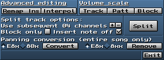

Allows advanced editing of the track, pattern, selection block or song.
Opened with `Ctrl+A`.

The options for editing include:

### "Remap Ins" button

Instrument remapping (`Remap Ins`) changes the notes playing the first instrument so that they play
the second instrument. Opens an external popup window seen below.


### "Interpol" button

Interpolates the volume (if the volume column is selected), note pitch (if notes are selected), or
both.

### "Volume scale"

Multiplies the start and end volumes of the track (`Track`), pattern (`Patt`), or selection block
(`Block`), and then interpolates the volume between them, where it is defined.
Opens an external popup window seen below.

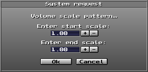

### "Split track options:"

"Spreads" the cells apart into the number of subsequent channels (tracks) selected by the user.
`Block only` applies the changes to the block. `Insert note off` puts note-offs whenever a note is
moved into a subsequent channel. `SPLIT` applies the splitting.

<!-- MISSING: ### "Panning conversion" -->

# About window


An "About" window with some cool visuals and text! :)

A quick look at the source code reveals that the text in question is:

```
Welcome to MilkyTracker! The open-source, cross-platform FastTracker II compatible music tracker.

Now heads-up for some credits!

MilkyTracker contains code from the following people:
Peter 'pailes' Barth (original author),
Antti S. Lankila (Amiga filter algorithm/coefficients),
Andrew Simper (noise code),
David Ross (EQ code),
Heikki Orsila/Stuart Caie/Claudio Matsuoka (PowerPacker decrunching),
Julian 'jua' Harnath (Haiku port),
Varthall (Amiga port),
Christopher 'Deltafire' O'Neill (current maintainer),
Dale 'd0pefish' Whinham (Cocoa and SDL2 ports, current maintainer),
Henri Isojarvi (GUS fixes, GUI improvements),
Corvus Corax (sample editor code),
David Seifert.

MilkyTracker also makes use of some common 3rd party libraries:
RtMidi/RtAudio,
zlib & zziplib (ZIP/GZIP extraction),
lhasa (LHA extraction)

The following people manipulated pixels: kenet, raina, IDC

ASCII art was provided by H2o

As special shout-out to everyone who has contributed to MilkyTracker by
dropping emails, writing bug reports, drawing fonts, producing tutorials
(both text and video) and producing music! A *HUGE* shout-out goes to
pailes for creating one of the most popular trackers ever created!
Now enjoy your stay, and happy tracking!
---- wrapping ---- wrapping ---- wrapping ---- .....
```

---

[0. INTRODUCTION](./intro.md)

[1. TRACKER BASICS](./basics.md)

[2. THE XM FILE FORMAT](./xm.md)

[2.1. EFFECT GLOSSARY](./fx.md)

[3. MILKYTRACKER UI REFERENCE](./ui.md)

**3.1. INTERACTIVE UI ELEMENTS**
- [Startup](#startup)
- [Main window](#main-window)
	- [Tabs](#tabs)
- [General editor](#general-editor)
	- [The song arranger](#the-song-arranger)
	- [Song title, length and peak window + Common MT options toggle window](#song-title-length-and-peak-window--common-mt-options-toggle-window)
	- [Song and editing properties](#song-and-editing-properties)
	- [Pattern editing window](#pattern-editing-window)
	- [General editor buttons window](#general-editor-buttons-window)
	- [Instrument menu](#instrument-menu)
	- [Sample menu](#sample-menu)
	- [Instrument editor](#instrument-editor)
	- [Sample editor](#sample-editor)
	- [Disk operations window](#disk-operations-window)
		- ["List" view](#list-view)
		- ["Simple" view](#simple-view)
		- [HD Recorder window](#hd-recorder-window)
- [Pattern editor](#pattern-editor)
- [Scopes](#scopes)
- [Transposition window](#transposition-window)
- [Zapper window](#zapper-window)
- [Quick options window](#quick-options-window)
- [Configuration window](#configuration-window)
- [Optimization window](#optimization-window)
- [Advanced editor](#advanced-editor)
- [About window](#about-window)

[3.2. WORKING WITH SAMPLES](./samples.md)

[3.3. WORKING WITH THE PATTERN EDITOR](./playlist.md)

[4. CONFIGURING MILKYTRACKER](./config.md)

[4.1. KEYBIND OPTIONS](./keybind.md)

[5. TIPS AND TRICKS](./tips.md)

[6. GOOD SOURCES](./sources.md)

[7. MAKING AN EXAMPLE SONG IN MILKYTRACKER](./song.md)

[8. THANKS](./thanks.md)

[9. MISSING DOCUMENTATION](./missing.md)
