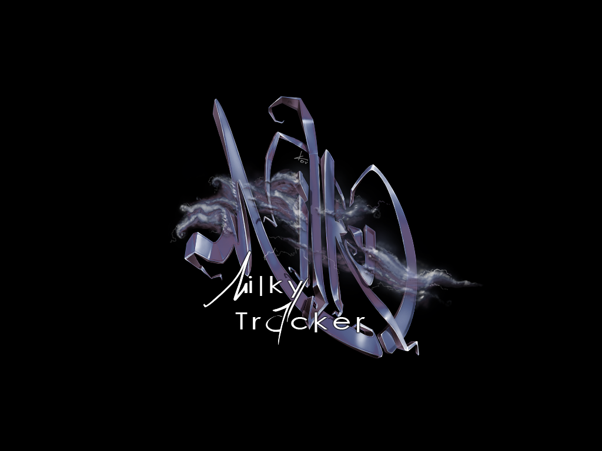

# MILKYTRACKER UI

Here, we'll be covering the MT's UI and how to navigate around it.

I'll use shortcuts to indicate keyboard actions, such as `Ctrl+S`.
Keep in mind that `Ctrl` is the control key, `Sh` is the shift key, `Spc` is the space bar and `Alt` is, well, the alt key!

# Startup

Upon first startup, you are going to be greeted by the MT splash screen:

This is easily disabled in the settings (`Misc. > Other > Splash screen`).

Afterwards, MT loads the main (startup) window:

This is the only true window in MT, all other "windows" that I refer to are just subwindows within the main window.

From here, you will be managing everything, from modules to the way your tracker works and looks.

You can always return to the main window by hitting `Ctrl+X`.

# General editor

The general editor is the top-left window visible from the main window.

From here, you'll manage various properties relating to your song, your editing of the song, as well as toggle other windows.

# Instrument menu

# Sample menu

# Instrument editor

# Sample editor

# Disk operations window
