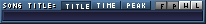

# MILKYTRACKER UI

Here, we'll be covering the MT's UI and how to navigate around it.

I'll use shortcuts to indicate keyboard actions, such as `Ctrl+S`.
Keep in mind that `Ctrl` is the control key, `Sh` is the shift key, `Spc` is the space bar and `Alt` is, well, the alt key!

Also, I'll be covering the various elements of the UI by covering the elements you'll be using commonly, and then the rest.

# Startup

Upon first startup, you are going to be greeted by the MT splash screen:


Afterwards, MT loads the [main window](#main-window).

The startup splash screen is easily disabled in the settings (`Misc. > Other > Splash screen`).

# Main window


This is the only real GUI window in MT, all other "windows" that I refer to are just subwindows within the main window.

From here, you will be managing everything, from modules to the way your tracker works and looks.

You can always return to the main window by hitting `Ctrl+X`.

The elements in this window, from top-left to bottom-right, are:

1. [The general editor](#general-editor)
2. [The instrument menu](#instrument-menu)
3. [The sample menu](#sample-menu)
4. [The scopes](#scopes)
5. [The playlist](#playlist)

# General editor


The general editor is the top-left window visible from the [main window](#main-window).

From here, you'll manage various properties relating to your song, your editing of the song, as well as toggle other windows.

You can return to this window by either hitting `Exit` on the windows that take its place (like the [disk operation window](#disk-operations-window), [transposition window](#transposition-window), etc) or by going back to the main window with `Ctrl+X`.

The elements in this window, from top-left to bottom-right, are:

1. The song arranger
2. Song title, length and peak window + Common MT options toggle window
4. Song and editing properties
5. Pattern editing window
6. General editor buttons window

## The song arranger


Regular.


Expanded using the pattern sequence display expansion button.

<br>

This window is used to arrange the patterns you've created into the final song.

<br>

- **Pattern sequence display**:
Allows you to view the song order number (in hex) and the pattern number (in hex), one next to the other.
In a new module, you have the pattern `00` set to order `0`.

- **Pattern sequence display expansion button**:
This button is above the `SEQ` button and allows you to hide the song pattern length and repeating song order number.
This, in turn, expands the pattern sequence display further down, and allows for more readability.
Hitting the button toggles this behaviour on and off.
The example of this behaviour is above, on the second image of the section.

- `SEQ` **button**:
Add a new pattern after the current one, if possible, so that its pattern number is the incremented previous pattern number.
So, if your pattern sequence is:
```
0 | 00
```
By hitting `SEQ` you will generate the following sequence:
```
0 | 00
1 | 01
```
If the current pattern in the sequence has the pattern number `FF`, the next one will be `00`, as well as every pattern after that next one.

- `CLN` **button**:
Works the same way as the `SEQ` button, except that it copies the content of the current pattern into the next one.

- `Ins.` **button**:
Inserts the current pattern at the next song order number.
The button has no effect if there are 255 patterns in the song.

- `Del` **button**:
Deletes the pattern from the current song order number and moves the next pattern into the deleted slot.
If there are no patterns after the deleted one (that is, if we deleted the last one) we just move back one song order to the previous pattern.
The button has no effect if there's only one pattern in the song.

- `+/-` **buttons between** `Ins.` **and** `Del`:
Increments or decrements the number of the pattern at the current song order.

- `+/-` **buttons next to the song pattern length**:
Adds a new pattern to the end of the song, or removes a pattern from the end of the song.
In case a new pattern is added, it's pattern number is `00`.

- `+/-` **button next to the repeating order number**:
Increments or decrements the repeating song order.

## Song title, length and peak window + Common MT options toggle window



## Song and editing properties


## Pattern editing window


## General editor buttons window


# Instrument menu

# Sample menu

# Instrument editor

# Sample editor

# Disk operations window

# Playlist

# Scopes

# Transposition window

# Zapper window

# Options window

# Configuration window

# Optimization window

# Advanced editor

# About window

---

[>>> TRACKER BASICS](./basics.md)<br>
[>>> THE XM FILE FORMAT](./xm.md)<br>
[>>> WORKING WITH SAMPLES](./samples.md)<br>
[>>> CONFIGURING MILKYTRACKER](./config.md)

[>>> BACK TO START](../README.md)
