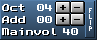

# MILKYTRACKER UI

Here, we'll be covering the MT's UI and how to navigate around it.

I'll use shortcuts to indicate keyboard actions, such as `Ctrl+S`.
Keep in mind that `Ctrl` is the control key, `Sh` is the shift key, `Spc` is the space bar and `Alt` is, well, the alt key!

Also, I'll be covering the various elements of the UI by covering the elements you'll be using commonly, and then the rest.

# Startup

Upon first startup, you are going to be greeted by the MT splash screen:


Afterwards, MT loads the [main window](#main-window).

The startup splash screen is easily disabled in the settings (`Misc. > Other > Splash screen`).

# Main window


This is the only real GUI window in MT, all other "windows" that I refer to are just subwindows within the main window.

From here, you will be managing everything, from modules to the way your tracker works and looks.

You can always return to the main window by hitting `Ctrl+X`.

The elements in this window, from top-left to bottom-right, are:

1. [The general editor](#general-editor)
2. [The instrument menu](#instrument-menu)
3. [The sample menu](#sample-menu)
4. [The scopes](#scopes)
5. [The playlist](#playlist)

# General editor


The general editor is the top-left window visible from the [main window](#main-window).

From here, you'll manage various properties relating to your song, your editing of the song, as well as toggle other windows.

You can return to this window by either hitting `Exit` on the windows that take its place (like the [disk operation window](#disk-operations-window), [transposition window](#transposition-window), etc) or by going back to the main window with `Ctrl+X`.

The elements in this window, from top-left to bottom-right, are:

1. The song arranger
2. Song title, length and peak window + Common MT options toggle window
4. Song and editing properties
5. Pattern editing window
6. General editor buttons window

## The song arranger

 Regular.<br>
 Expanded view.

This window is used to arrange the patterns you've created into the final song.

- **Pattern sequence display**:
Allows you to view the song order number (in hex) and the pattern number (in hex), one next to the other.
In a new module, you have the pattern `00` set to order `0`.

- **Pattern sequence display expansion button**:
This button is above the `SEQ` button and allows you to hide the song pattern length and repeating song order.
This, in turn, expands the pattern sequence display further down, and allows for more readability.
Hitting the button toggles this behaviour on and off.
The example of this behaviour is above, on the second image of the section.

- `SEQ` **button**:
Adds a new pattern after the current one, if possible, so that its pattern number is the incremented previous pattern number.
So, if your pattern sequence is:
```
0 | 00
```
By hitting `SEQ` you will generate the following sequence:
```
0 | 00
1 | 01
```
If the current pattern in the sequence has the pattern number `FF`, the next one will be `00`, as well as every pattern after that next one.

- `CLN` **button**:
Works the same way as the `SEQ` button, except that it copies the content of the current pattern into the next one.

- `Ins.` **button**:
Inserts the current pattern at the next song order number.
The button has no effect if there are 255 patterns in the song.

- `Del` **button**:
Deletes the pattern from the current song order number and moves the next pattern into the deleted slot.
If there are no patterns after the deleted one (that is, if we deleted the last one) we just move back one song order to the previous pattern.
The button has no effect if there's only one pattern in the song.

- `+/-` **buttons between** `Ins.` **and** `Del`:
Increments or decrements the number of the pattern at the current song order.

- `+/-` **buttons next to the song pattern length**:
Adds a new pattern to the end of the song, or removes a pattern from the end of the song.
In case a new pattern is added, its pattern number is `00`.
The `+/-` buttons next to the song pattern length in the exapnded view have the same effect.

- `+/-` **button next to the repeating song order**:
Increments or decrements the repeating song order.

## Song title, length and peak window + Common MT options toggle window


- **"TITLE", "TIME" and "PEAK" tabs**:
Allows the selection of which of those three things you want to look at.

- **Song title text field tab**:
When right-mouse of left-mouse clicked, allows the editing of your song's title.
You exit the title editing mode by hitting `Esc`.
When right-mouse or left mouse-clicking somewhere in the text, you move the cursor to that position.
By default, the song title is blank.

- **Song length tab**:
Allows viewing the current time (hour:minute:second) that has elapsed since the module started playback, and the total time.
By default, in an empty startup module, the text in the tab reads `00:00:00 (00:00:07)`.
The `ESTIMATE` button estimates the total length of the song.
You usually have to click this button manually, but you can have MT estimate the time for you once the module is loaded, by ticking a checkbox in the settings (`Misc. > Other > ESTIMATE PLAYTIME AFTER LOAD`).

- **Song peak tab**:
Reads the intensity of the sound generated by the playback.
As per default, the peak is split into the left signal (left of center) and right signal (right of center), as well as the quiet (green), sufficient (yellow) and loud (red) areas.
If the song clips, the `PEAK LEVEL:` text above the peak will turn red. Right-mouse clicking it resets it back to its default color, white.

- **Common MT options toggle window**:
This window consists of four buttons labeled `F`, `P`, `W` and `L`, in that order.
Right-mouse clicking these toggles their respective options.
The options are:

| Label | Keyboard shortcut | Name of the action, taken from the MT manual  | Description |
| -     | -                 | -                                             | - |
| `F`   | `Ctrl+F`          | Song follow                                   | If on, the cursor follows the playhead. |
| `P`   | `Ctrl+P`          | Prospective pattern view                      | If on, the previous and next patterns in the song are visible. |
| `W`   | `Ctrl+W`          | Pattern wrapping                              | If on, during editing of a pattern, the cursor will wrap and stay on the current pattern, instead of moving to the next or previous one. |
| `L`   | `Ctrl+L`          | Pattern change behavior (live mode)           | If on, when you change the current pattern while another pattern is playing, it will first play the current one entirely, and then move on to the next one. If off, the pattern change happens immedietly, without wait. Used in live performances. |

## Song and editing properties

 Regular.<br>
 Flipped view.

This window consists of a couple properties related to the song and how you edit it.
The `+/-` buttons are placed next to their respective properties.
The `FLIP` button flips the display to show the rest of the editable properties.

- **BPM**: The song's [BPM](./basics.md#ticks-spd-and-bpm).
- **Spd**: The song's [SPD](./basics.md#ticks-spd-and-bpm).
- **Add**: The ammount by which your cursor moves down after placing a note or effect. The cursor loops if pattern wrapping (`Ctrl+W`) is on.
- **Oct**: The octave of the notes you place (ex. if `Oct` is equal to `04`, then the lowest key you can place with your keyboard is C4).
- **The** `Mainvol` **property**: The song which shows you the [global song volume](./xm.md#global-song-volume).

## Pattern editing window


- `+/-` **buttons next to** `Patn.`:
Switch between different patterns.

- `+/-` **buttons next to** `Len.`:
Increase or decrease the pattern length.
This action is desctructive; in case you shorten the pattern so certain notes disappear, they cannot be brought back by increasing the pattern length.
You can, however, bring them back by undoing your chagnes (`Ctrl+Alt+Z`).

- `Expand` **button**:
Doubles the pattern length, by inserting an empty pattern line on each second line (line 1 - empty line - line 2 - empty line - ...).

- `Shrink` **button**:
Halves the pattern length, by deleting even second line (line 1 - line 3 - line 5 - line 7...).
This action is desctructive; expanding a shrinked pattern will not bring back notes that were removed.
You can, however, bring them back by undoing your chagnes (`Ctrl+Alt+Z`).

## General editor buttons window


- [`Zap` - Zapper]()
- [`Load` - Load module]()
- [`Save` - Save module]()
- [`As...` - Save module as...]()
- [`Disk Op.` - Disk operations]()
- [`Smp. Ed.` - Sample editor]()
- [`Ins. Ed.` - Instrument editor]()
- [`Adv. Edit` - Avdanced editor]()
- [`Transpose` - Note trasposition]()
- [`About` - About MT]()
- [`Optimize` - Module optimization]()
- [`Options` - Playback options]()
- [`Config` - MT configuration]()
- [`Play Sng` - Play module]()
- [`Pat` - Play pattern]()
- [`Pos` - Play from cursor position]()
- [`Stop` - Stop playback]()
- [`Rec` - Toggle recording (editing)]()
- [`Add` - Add tracks]()
- [`Sub` - Subtract (Remove) tracks]()

# Instrument menu

# Sample menu

# Instrument editor

# Sample editor

# Disk operations window

# Playlist

# Scopes

# Transposition window

# Zapper window

# Options window

# Configuration window

# Optimization window

# Advanced editor

# About window

---

[>>> TRACKER BASICS](./basics.md)<br>
[>>> THE XM FILE FORMAT](./xm.md)<br>
[>>> WORKING WITH SAMPLES](./samples.md)<br>
[>>> CONFIGURING MILKYTRACKER](./config.md)

[>>> BACK TO START](../README.md)
